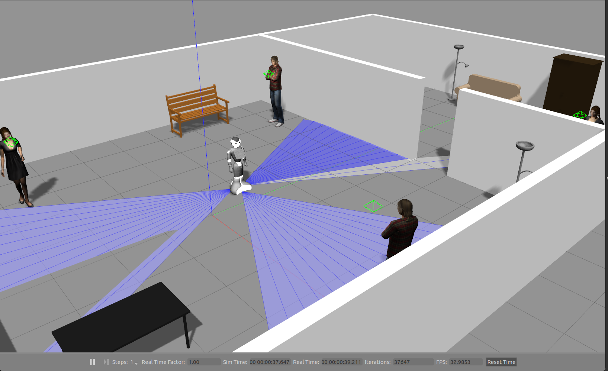

Virtual Pepper Gazebo Simulation
==============

**Table of contents:**

+ [Installation](#installation)

+ [Running the simulation](#running-the-simulation)
  + [Driving Pepper](#driving-pepper-in-simulation)
  + [RVIZ](#rviz)

+ [Notes from the original README](#notes-from-the-original-readme)

Forked from [here](https://github.com/awesomebytes/pepper_virtual). Massive thanks to [Sam Pfeiffer](https://github.com/awesomebytes) for doing the heavy lifting and addressing the absolute mess that is Pepper's ROS simulation.

Main contribution in this repo is a Dockerfile that completely streamlines the installation and fixes some missing steps, as well as some additional code snippets.

## Installation

Simply build a container from the provided Dockerfile. Thus, if you don't have it, [install Docker](https://docs.docker.com/engine/install/ubuntu/).

1. Clone the repo: `git clone https://github.com/frietz58/pepper_virtual `
2. CD into repo: `cd pepper_virtual`
3. Build image from provided Dockerfile: `sudo docker build -t awesome-pepper-sim .`

That's it. You can now start Docker containers based on the image and run the simulation, see [Running the simulation](#runnign-the-simulation)

## Running the simulation

Because we want to spawn GUIs from our containers, we need to allow Docker to open GUIs on the surrounding OS. Thus, before starting the conainter, run: `xhost +local:root`. More on this [here](https://riptutorial.com/docker/example/21831/running-gui-apps-in-a-linux-container).

1. Start a container from the image: `sudo docker run -it -v /tmp/.X11-unix:/tmp/.X11-unix -e DISPLAY=unix$DISPLAY awesome-pepper-sim`
2. In the container, source the catkin workspace that was build during the building process of the Dockerfile: `source /catkin_ws/devel/setup.bash`
3. Start Gazebo simulation based: `roslaunch pepper_gazebo_plugin pepper_gazebo_plugin_in_office_CPU.launch`

This should give you something similar to this:

### Driving Pepper in simulation

To drive Pepper in the gazebo simulation, attach a new bash shell to the running docker container:

1. Find the ID of the conainter: `sudo docker ps`
2. Attach new shell to the container with the given ID: `sudo docker exec -it <CONTAINER-ID> bash`
   1. Source the entrypoint and the catkin workspace: `source ros_entrypoint.sh && source /catkin_ws/devel/setup.bash`
3. Start rqt steering with Pepper's base topic: `rosrun rqt_robot_steering rqt_robot_steering --default_topic:=/pepper/cmd_vel`
4. Start joint trajectory controller: `rosrun rqt_joint_trajectory_controller rqt_joint_trajectory_controller`

You should now have something similar to this:

### RVIZ

You can visualize the model and topics in RVIZ. However, I found that adding trying th add any of the camera topics to RVIZ crashes the gazebo simulation... However, other topics work fine. 

1. Attach a new session as described in the previous step and source both the entrypoint and the workspace. 
2. Start RVIZ: `rosrun rviz rviz`
3. Fix the global fixed frame! RVIZ expects a map, but per default, there is non. Set `Fixed Frame` in the `Global Options` to to `base_footprint`, to have everything be displayed relative to Pepper's base!
4. Add the desired topics in the RVIZ GUI, for example `Add` --> `by topic` --> `pepper/laser_2/LaserScan`

After adding multiple topics, you should have something similar to this:

## Notes from the original README

Note that the provided launchfiles that have been tested are:
- `roslaunch pepper_gazebo_plugin pepper_gazebo_plugin_Y20.launch`
- `roslaunch pepper_gazebo_plugin pepper_gazebo_plugin_in_office.launch`

Or their variants that don't need a GPU (for the laser plugin):
- `roslaunch pepper_gazebo_plugin pepper_gazebo_plugin_Y20_CPU.launch`
- `roslaunch pepper_gazebo_plugin pepper_gazebo_plugin_in_office_CPU.launch`

And further variants that don't have the arms of the robot which reduce CPU load (useful for navigation tests, specially on underpowered computers). In my machine this used 30% less CPU on `gzserver`. Note that if you close/don't launch `gzclient` (the graphical interface of Gazebo) you'll save a lot of CPU too (more than 1 core or 110% CPU in `top -c` for me):
- `roslaunch pepper_gazebo_plugin pepper_gazebo_plugin_Y20_CPU_no_arms.launch`
- `roslaunch pepper_gazebo_plugin pepper_gazebo_plugin_in_office_CPU_no_arms.launch`

You'll find a topic `/pepper/laser_2` that unifies the 3 lasers of the robot in 1 topic (by reprojecting the points in a pointcloud and transforming them into `base_footprint`).

