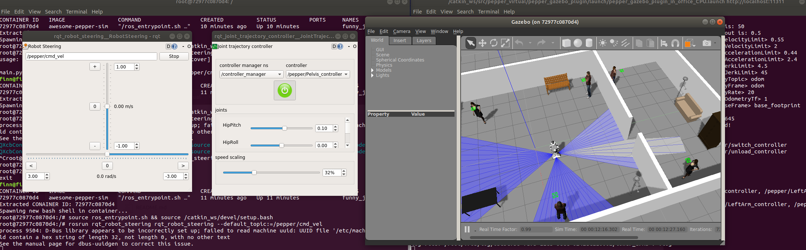
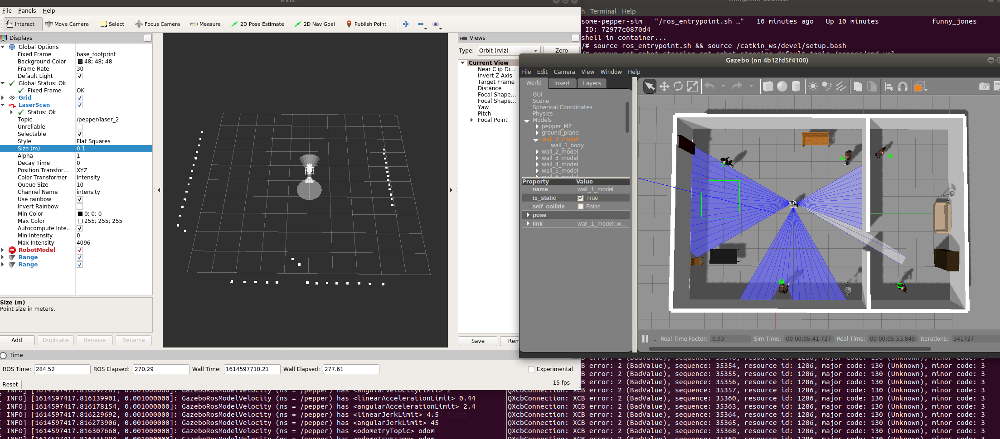
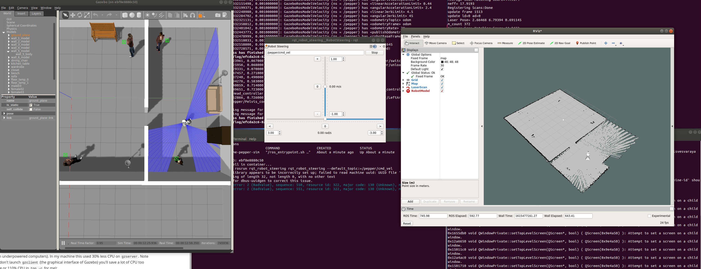
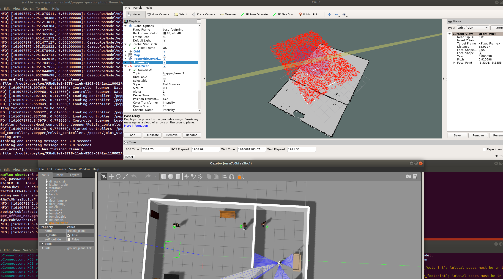
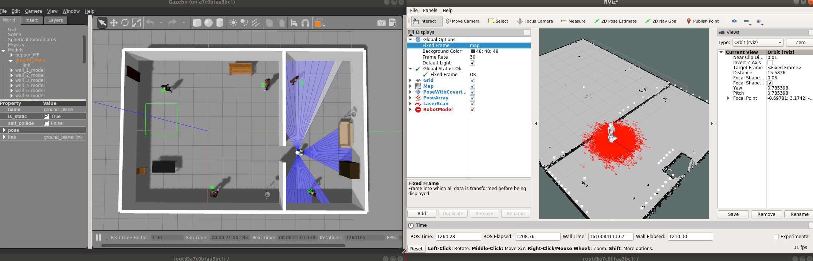
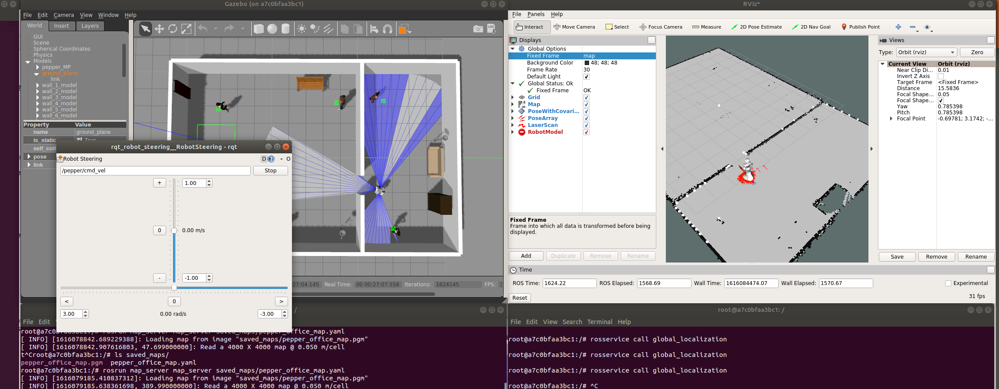
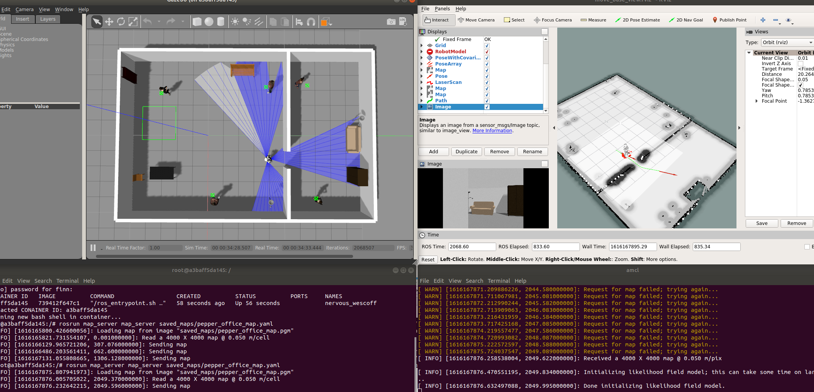

Virtual Pepper Gazebo Simulation
==============

Forked from [here](https://github.com/awesomebytes/pepper_virtual). Massive thanks to [Sam Pfeiffer](https://github.com/awesomebytes) for doing the heavy lifting and addressing the mess that is Pepper's ROS simulation.

Main contribution in this repo is a Dockerfile that streamlines the installation and fixes some missing steps (namely the installation of Pepper Meshes). Further, I hope to implement a complete SLAM + navigation stack in this repo, which is not the goal in the original repository.

**Table of contents:**

+ [Installation](#installation)

+ [Running the simulation](#running-the-simulation)
  + [Driving Pepper](#driving-pepper-in-simulation)
  + [RVIZ](#rviz)
+ [Gmapping](#gmapping)

+ [AMCL Localization](#amcl-localization)

+ [move_base navigation](#move_base-navigation)
  
+ [Notes from the original README](#notes-from-the-original-readme)

+ [Troubleshooting](#troubleshooting)

# Installation

Simply build a container from the provided Dockerfile. Thus, if you don't have it, [install Docker](https://docs.docker.com/engine/install/ubuntu/) first. Then:

1. Clone the repo: `git clone https://github.com/frietz58/pepper_virtual `
2. CD into repo: `cd pepper_virtual`
3. Build image from provided Dockerfile: `sudo docker build -t awesome-pepper-sim .`

That's it. You can now start Docker containers based on the image and run the simulation, see [Running the simulation](#runnign-the-simulation)

## Running the simulation

Because we want to spawn GUIs from our containers, we need to allow Docker to open GUIs on the surrounding OS. Thus, before starting the container, run: `xhost +local:root`. More on this [here](https://riptutorial.com/docker/example/21831/running-gui-apps-in-a-linux-container).

1. Start a container from the image: `sudo docker run -it -v /tmp/.X11-unix:/tmp/.X11-unix -e DISPLAY=unix$DISPLAY awesome-pepper-sim`

   Note, that you would have to source the `ros_entrypoint.sh` as well as the `catkin_ws` at this point. However, because we adjust the `.bashrc` of the image in the Dockerfile, this happens automatically (see `/root/.bashrc` in the container at the very bottom)... 
3. Start Gazebo simulation: `roslaunch pepper_gazebo_plugin pepper_gazebo_plugin_in_office_CPU.launch`

This should give you something similar to this:

If gazebo doesn't start and crashes with exit code `134`, something is wrong with the xhost setting on your system and docker can't open containers. Did you run `xhost +local:root` before starting the container?

If gazebo doesn't start and crahes with exit code `139`, see the troubleshooting section below...

### Driving Pepper in simulation

To drive Pepper in the gazebo simulation, attach a new bash shell to the running docker container:

1. Find the ID of the conainter: `sudo docker ps`
2. Attach new shell to the container with the given ID: `sudo docker exec -it <CONTAINER-ID> bash`
3. Start rqt steering with Pepper's base topic: `rosrun rqt_robot_steering rqt_robot_steering --default_topic:=/pepper/cmd_vel` Note, that (for whatever reason) **the parameter `default_topic` appears to work in roughly 50% of the cases**. Thus, make sure that that the topic for the steering commands is set to `/pepper/cmd_vel`!
4. Start joint trajectory controller: `rosrun rqt_joint_trajectory_controller rqt_joint_trajectory_controller`

You should now have something similar to this:

### RVIZ

You can visualize the model and topics in RVIZ. Using the `xhost +local:root` method describes above, the gazebo simulation crashes when a raw image from any of the camera sensors is visualized in RVIZ. I don't know exactly why this happens, but this can be fixed if the container is started with `sudo rocker` instead of `sudo docker`. To install `rocker`, follow the steps described under [Troubleshooting](#gazebo-exit-code-139-and-NVIDIA-drivers).
 
1. Attach a new session as described in the previous step and source both the entrypoint and the workspace. 
2. Start RVIZ: `rosrun rviz rviz`
3. Fix the global fixed frame! RVIZ expects a map, but per default, there is none. Set `Fixed Frame` in the `Global Options` to `base_footprint`, to have everything be displayed relative to Pepper's base!
4. Add the desired topics in the RVIZ GUI, for example `Add` --> `by topic` --> `pepper/laser_2/LaserScan`

After adding multiple topics, you should have something similar to this:

## Gmapping

Map update is still very slow, not sure why the `map_update_interval` param isn't doing anything. Also not sue why the `_` underscore must be inserted before the parameter. But this solves the error we get otherwise: https://answers.ros.org/question/272752/how-to-pass-a-parameter-of-type-double-as-an-input-to-a-roscpp-node/

To map a virtual environment:

1. Start simulation:`roslaunch pepper_gazebo_plugin pepper_gazebo_plugin_in_office_CPU.launch`
2. Start gmapping: `rosrun gmapping slam_gmapping base_frame:=base_footprint odom_frame:=odom map_frame:=map _map_update_interval:=1.0 scan:=/pepper/laser_2 _temporalUpdate:=1`

What fixes the slow update of the map in RVIz is the combination of the parameters `_temportalUpdate:=1` and `_map_update_interval:=1.0`!!! This forces gmapping to update the map if the last updates is older than one second. I don't know why it updates so rarely when this parameter is left on default (-1). 

3. Visualize in Rviz: `rosrun rviz rviz` Then `Add` --> `by topic` --> `/map`

This should give you something like this:

3. Save map: `rosrun map_server map_saver -f pepper_office_map`
4. Export map out of container (or persist it by commiting the current container state): `sudo docker cp <CONTAINER-ID>:/pepper_office_map.pgm .`

## AMCL Localization
AMCL is a localization package that, given a map and laser data, localizes a robot on the given map via a particle filter. For ROS, this means that AMCL provide the transformation between the robot's transformation base frame and the map! Without this transformation, the robot would not be able to interact with the map, because it does not know its relation to the map...

1. Start simulation as usual: `roslaunch pepper_gazebo_plugin pepper_gazebo_plugin_in_office_CPU.launch`
2. Make previously created map available to localization algorithm via map_server: `rosrun map_server map_server saved_maps/pepper_office_map.yaml` 
3. Start `amcl` node: `rosrun amcl amcl scan:=/pepper/laser_2 _transform_tolerance:=1.0 _base_frame_id:=base_footprint`
4. Optionally (but recommended) setup RVIZ to monitor localization: `rosrun rviz rviz`. Set fixed frame to `base_footprint`
 Add topics `/map` (the map we publish via map_server), `/amcl_pose` (the pose of the robot, estimated on the map, based on laser data), `/particle_cloud` (all particle locations used in amcl particle filter, useful for estimating accuracy of pose). 
5. Initialize localization: `rosservice call global_localization` (service is provided by amcl). Note, that you can just execute this again, to reset the localization progress, for example if amcl converged to the wrong location.
Now, in RVIZ, you should have something similar to this:

Alternatively, you can give amcl a prior for the particle distribution via RVIZ. For this, first set the **fixed frame** to `map` (we can do this because amcl provide the transform), then, use the  `2D Pose Estimate` button in RVIZ's tool panel. The result is a less evenly spread out initialization, which converges to the true robot position faster:  AMCL has to accumulate a history of laser measurements to accurately estimate the position of the robot on the map. Thus, simply drive around the environment and let amcl collect data. TODO: link between RVIZ and AMLC seems to be not there yet, investigate this!  6. Bringup `rqt_steering` or other drive controller: `rosrun rqt_robot_steering rqt_robot_steering --default_topic:=/pepper/cmd_vel` After a while, amcl localization should converge, depending on the unambiguity of the laser data in the environemnt, yielding something close to the this: 

## move_base navigation
move_base generates a path based on the location of the robot on the map and a goal on the map. Configuring move base requires a lot of parameters, which is not practial to maintain in one command (configuration explained [here](http://wiki.ros.org/navigation/Tutorials/RobotSetup)). As such, the configuration for this specific pepper model is provided in the folder `move_base_configuration`, where the launchfile `move_base.launch` instanciates move_base with the required parameters.

Specifically for this simulated pepper model we remap the velocity stream, which is produced by move_base to travel from the location to the goal, from the default topic (`cmd_vel`) to `/pepper/cmd_vel`. The rest of the configuration essentially makes sure that the costmaps (local for obstacle avoidance and global for path planning) get the required laser sensor data from the pepper model. 

1. Start move_base from the provided launchfile: `roslaunch move_base_configuration/move_base.launch`
2. Start RVIZ: Continue with the RVIZ instance/configuration from the amcl navigation step. Add topics two new visualization of type `map` and set their topics to `/move_base_node/global_costmap/costmap` and `/move_base_node/local_costmap/costmap`. This shows the costmap used by move_base for planning the trajectories. Add a visualzation of type `path` and set its topics to `/move_base_node/TrajectoryPlannerROS/global_plan`, to see the plan/path generated by move_base to reach the goal on the map.

Alternatively, use the provided rviz configuration which has all the topics added and configured: `rosrun rviz rviz -d move_base_configuration/move_base_view.rviz`

3. In RVIZ, begin amcl localization via the `2D Pose Estimate` btn, so that the particle filter roughly corresponds to Pepper's location in the simulation. You can drive around with `rqt_steering` to gain a more precise estimate of the location. Once happy, use the `2D Nav Goal` btn in RVIZ to select the goal on the map to which you'd like Pepper to navigate. 
This should look like this: 

A video of the navigation is available [here](https://youtu.be/LZ7xFTIqGZE)...

## Notes from the original README

Note that the provided launchfiles that have been tested are:
- `roslaunch pepper_gazebo_plugin pepper_gazebo_plugin_Y20.launch`
- `roslaunch pepper_gazebo_plugin pepper_gazebo_plugin_in_office.launch`

Or their variants that don't need a GPU (for the laser plugin):
- `roslaunch pepper_gazebo_plugin pepper_gazebo_plugin_Y20_CPU.launch`
- `roslaunch pepper_gazebo_plugin pepper_gazebo_plugin_in_office_CPU.launch`

And further variants that don't have the arms of the robot which reduce CPU load (useful for navigation tests, specially on underpowered computers). In my machine this used 30% less CPU on `gzserver`. Note that if you close/don't launch `gzclient` (the graphical interface of Gazebo) you'll save a lot of CPU too (more than 1 core or 110% CPU in `top -c` for me):
- `roslaunch pepper_gazebo_plugin pepper_gazebo_plugin_Y20_CPU_no_arms.launch`
- `roslaunch pepper_gazebo_plugin pepper_gazebo_plugin_in_office_CPU_no_arms.launch`

You'll find a topic `/pepper/laser_2` that unifies the 3 lasers of the robot in 1 topic (by reprojecting the points in a pointcloud and transforming them into `base_footprint`).

## Troubleshooting

#### Gazebo exit code 139 and NVIDIA drivers
I started encountering this error after updating my nvidia-drivers and installing CUDA on my system. For some reason, with new nvidia-drivers installed, I could no longer spawn any GUIsfrom inside docker, even after applying the `xhost +local:root` fix. I can not further pinpoint why installing CUDA appears to have this side-effect, but I am very certain that this is the cause of the issue. The only way I was able to fix this was by installing the `rocker` docker extension. Install it from [here](https://github.com/osrf/rocker). Note, that it requires `nvidia-docker` to be installed PLUS a supported NVIDIA driver version, which solidifies my assumption that something fishy is going on with docker GUIs and NVIDIA drivers...
Once you've installed rocker, start our the container using rocker instead of docker, like this: `sudo rocker --nvidia --x11 awesome-pepper-sim`

now, you should be able to spawn GUIs from inside the docker container, even when you have CUDA installed.

